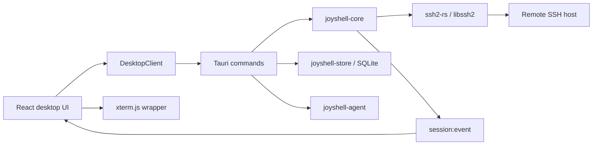

# Joyshell

Joyshell 是一款正在开发中的跨平台桌面 SSH 工作区，目标是在保持现代 UI、主题与文件管理体验的同时，将高频 SSH、SFTP 和系统监控 I/O 放在 Rust 后端处理，避免 Electron 级别的运行时开销。

当前桌面版本：`0.1.52`。

> 项目仍处于早期开发阶段。Windows 是当前主要开发和验收平台；macOS、Linux 的工程结构和 Tauri 打包目标已预留，但尚未完成同等强度的实机验证。

## 已实现

- Tauri 2 桌面壳，React + TypeScript UI，xterm.js 终端。
- 基于 `ssh2-rs/libssh2` 的真实 SSH 密码认证、PTY 和交互式 Shell。
- 多服务器标签、分组、搜索、收藏、自定义排序及拖拽调整。
- 一个服务器 Profile 可同时打开多个相互独立的 Shell；已连接服务器双击行为可选择打开最早 Shell 或新建 SSH 连接。
- SFTP 目录浏览、创建、删除、重命名、上传、下载、取消、失败重试和偏移续传。
- 原生文件选择器、拖放上传、应用内右键菜单和传输队列。
- 文件面板支持 `120-390px` 鼠标/键盘调高调低，并将高度保存到 SQLite；继续拖到最小高度以下会自动收起。
- 终端、SFTP 与系统信息使用独立 SSH side session，避免大文件传输阻塞终端输入。
- 远端 CPU、内存、磁盘、网络、进程、负载和运行时间采集。
- 系统探针结果持久化到服务器 Profile，并在主页显示对应操作系统图标。
- TCP/SSH RTT 时延显示，终端交互采样与断线确认。
- SQLite 本地存储：服务器、文件夹、命令片段、布局和个性化设置。
- AES-256-GCM 加密保存密码，不在 SQLite 中写入明文。
- 全页设置、背景图裁剪、开机动画图片、终端/主页背景和多套渐变主题。
- Agent 权限、工具注册、记忆和多 Provider 配置的数据模型与基础测试。

## 尚未完成

- 私钥、SSH Agent、跳板机和端口转发的真实连接实现。
- known_hosts 持久化和严格主机密钥校验流程。
- 自动重连及跨重启持久化传输队列。
- 本地 Shell/PTY、终端分屏和完整快捷键管理。
- 实际模型请求、Agentic Loop UI、MCP Server 管理和 CLI。
- OS Keychain/Credential Manager/Secret Service；当前密码使用本地派生密钥加密。
- macOS/Linux 安装包的持续集成和实机验收。
- Android/iOS UI。

## 技术架构



高频终端输出由事件推送，前端保留 `terminal_output_tail` 轮询作为 MVP 兜底。SFTP 与系统监控不会在交互式 Shell worker 中执行阻塞操作。

## 仓库结构

```text
apps/desktop/                 Tauri 桌面应用与 React UI
  src/app/                    应用组合入口
  src/features/               sessions/terminal/sftp/transfers/settings 等领域模块
  src/platform/               DesktopClient 与统一事件订阅
  src/shell/                  窗口、布局和全局渐变控制
  src-tauri/                  Tauri commands、窗口能力和打包配置
crates/joyshell-core/         SSH、SFTP、系统采集和会话生命周期
crates/joyshell-store/        SQLite、密码加密、审计和记忆存储
crates/joyshell-agent/        助手定义、工具、权限和模型配置抽象
packages/terminal/            xterm.js React wrapper
packages/ui/                  无业务状态的共享 UI 包
doc/                          组件难点、解决方案和开发历程
docs/                         早期技术调研与总体实现说明
```

## 环境要求

Windows 开发环境：

- Node.js 20+ 与 pnpm。
- Rust stable 与 Cargo。
- Visual Studio Build Tools，包含 MSVC 和 Windows SDK。
- WebView2 Runtime。
- Tauri 2 所需的 Windows 打包工具。

本机 Cargo 安装在 `C:\Users\EDY\.cargo\bin`。若命令行未加入 PATH：

```powershell
$env:PATH="C:\Users\EDY\.cargo\bin;$env:PATH"
```

## 开发运行

```powershell
pnpm install
pnpm dev
```

`pnpm dev` 启动 Vite 预览，默认地址为 `http://127.0.0.1:5173`。它与桌面包使用同一套 React 代码，但浏览器预览使用 `DesktopClient` 的预览实现，不能代替真实 SSH/Tauri 验收。

运行 Tauri 开发窗口：

```powershell
pnpm --filter @joyshell/desktop tauri dev
```

## 测试与构建

```powershell
pnpm test
pnpm build
cargo test --workspace
pnpm --filter @joyshell/desktop tauri build
```

截至 `0.1.52`：

- 前端生产构建通过。
- 前端权限与会话策略测试 `5/5` 通过。
- Rust workspace 实际单元测试 `8/8` 通过，doc tests 通过。
- 同一 Profile 双独立 SSH Session 实机探针通过。
- Windows NSIS 和 MSI 构建通过。
- OpenSSL 静态库可能产生缺少 `ossl_static.pdb` 的链接警告，不影响 release 安装包运行。

Windows 输出：

```text
target/release/bundle/nsis/Joyshell_0.1.52_x64-setup.exe
target/release/bundle/msi/Joyshell_0.1.52_x64_en-US.msi
```

## 安全说明

- 不要把真实密码、私钥、Token 或测试服务器地址提交到仓库和文档。
- SFTP 写操作、删除操作和危险操作应经过确认并记录审计信息。
- 当前本地密码加密是过渡方案，不等价于操作系统硬件/账户保护的凭据库。
- 当前 `HostKeyPolicy` 数据模型已存在，但完整 known_hosts 工作流仍未完成，不能把当前版本视为已满足企业级 SSH 安全要求。

## 文档

- [开发文档索引](doc/README.md)
- [开发历程与问题记录](doc/development-history.md)
- [前端保守解耦](doc/components/frontend-decoupling.md)
- [桌面窗口与统一渐变](doc/components/desktop-chrome-and-gradient.md)
- [SSH 桌面客户端调研](docs/research-ssh-client-tech-selection.md)
- [总体实现状态](docs/implementation-notes.md)

## 参考与归属

项目实现参考了 xterm.js、libssh2/ssh2-rs、OpenSSH、WinSCP、FileZilla、Glances、psutil、Netdata 等成熟项目或官方接口。参考不代表复制其专有 UI 或受限制代码。字体和 Iconfont 素材来源、许可证注意事项见 `doc/components` 中的归属说明。
