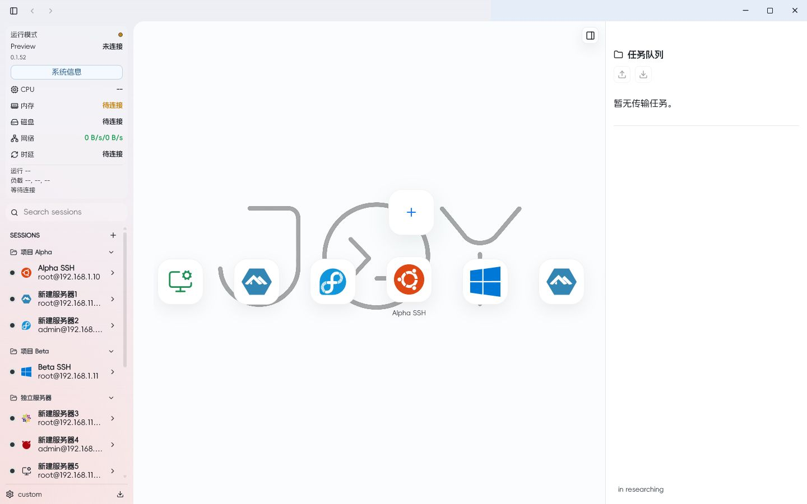
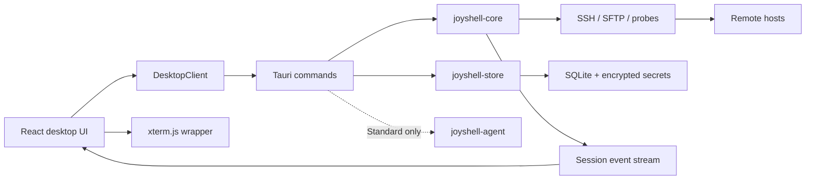

<p align="center">
  <picture>
    <source media="(prefers-color-scheme: dark)" srcset="apps/desktop/src/assets/brand/joy-o-line-bold-dark.svg">
    <source media="(prefers-color-scheme: light)" srcset="apps/desktop/src/assets/brand/joy-o-line-bold-light.svg">
    
  </picture>
</p>

<h1 align="center">Joyshell</h1>

<p align="center">
  面向桌面环境的现代 SSH 工作区。<br>
  将终端、远程文件、主机状态与智能助手能力放进一个安静、连贯的操作界面。
</p>

<p align="center">
  <a href="https://github.com/Aaaou/Joyshell/stargazers"></a>
  <a href="https://github.com/Aaaou/Joyshell/network/members"></a>
  <a href="https://github.com/Aaaou/Joyshell/releases/tag/v0.1.69-build.4"></a>
  <a href="https://github.com/Aaaou/Joyshell/issues"></a>
  <a href="LICENSE"></a>
</p>

<p align="center">
  
  
  
  
</p>

<p align="center">
  <a href="#核心体验">核心体验</a> ·
  <a href="#版本规划">版本规划</a> ·
  <a href="#安装">安装</a> ·
  <a href="#架构">架构</a> ·
  <a href="#参与开发">参与开发</a> ·
  <a href="#路线图">路线图</a>
</p>

---

## Joyshell 是什么

Joyshell 是一个以 SSH 为核心的跨平台桌面工作区。项目使用 Tauri 2 构建桌面壳，由 Rust 处理 SSH、SFTP、主机探针和本地数据，React 与 xterm.js 提供高频交互界面。

设计目标很直接：连接服务器之后，终端输入、文件传输、系统观察和常用操作应当保持独立、清楚并且随时可达。

当前版本以 Windows 为主要开发与验收平台。macOS 与 Linux 已保留同构工程和打包目标，仍需要持续的实机验证。

## 界面预览

<p align="center">
  
</p>

<p align="center"><sub>Preview 数据仅用于界面展示，不包含真实服务器信息。</sub></p>

## 核心体验

| 能力 | 当前实现 |
| --- | --- |
| **真实 SSH 终端** | Rust `ssh2-rs/libssh2` 后端，支持密码、本机私钥文件和可选私钥口令认证，以及 PTY、交互式 Shell、xterm.js 渲染和断线反馈。 |
| **多服务器工作区** | 会话分组、搜索、收藏、排序、拖放和多标签；同一服务器可以打开多个相互独立的 Shell。 |
| **远程文件管理** | 密码与私钥会话均支持 SFTP 浏览、上传、下载、删除、重命名、拖放上传、原生文件选择器、任务队列和偏移续传。连接后自动从当前远端用户的主目录开始。 |
| **并发隔离** | 终端、SFTP 与系统监控使用独立连接路径，文件传输不会占用交互式 Shell 的工作通道。 |
| **主机状态** | CPU、内存、磁盘、网络、负载、进程、运行时间与 SSH 连通状态集中呈现。 |
| **本地优先** | 服务器、文件夹、命令片段、布局和个性化设置保存在本地 SQLite；密码和私钥口令使用 AES-256-GCM 加密，私钥正文不进入数据库。 |
| **桌面个性化** | 统一桌面渐变、窗口位置感知、背景图片裁剪、终端背景和启动动画。 |
| **Agent 基础架构** | 通用大助手与受限小助手模型，预留工具注册、审批权限、记忆、Provider、CLI 与 MCP 边界。 |

## 版本规划

Joyshell 计划同时维护两个官方版本。两者共享 SSH、SFTP、系统信息、SQLite 和桌面交互基础，区别集中在智能体与外部扩展能力。

| 版本 | 定位 | 包含内容 |
| --- | --- | --- |
| **Joyshell Standard** | 完整桌面工作区，也是当前主开发版本。 | SSH/SFTP、系统监控、本地数据、通用大助手、多个受限小助手、权限审批、长短期记忆、模型 Provider，以及后续 MCP/CLI 扩展。未配置模型时，SSH 基础功能仍可独立使用。 |
| **Joyshell Lite** | 面向 U 盘携带、离线部署和无外网环境的精简版本。 | 保留 SSH/SFTP、系统监控、会话管理、命令片段、SQLite 与个性化界面；从构建产物中移除 Agent runtime、模型 Provider、MCP、智能体界面和相关依赖。 |

### Standard 的 Agent 方向

- `GeneralAssistant` 负责解释输出、生成命令草案、拆分任务和汇总结果。
- `ExploreAssistant`、`SftpAssistant`、`OpsAssistant` 分别承担只读分析、文件计划和运维诊断。
- 所有工具统一经过 `allow / deny / ask` 权限判定；远程执行和写操作默认需要确认。
- 短期上下文、中期会话摘要与长期用户偏好使用分层记忆，并禁止保存密码、私钥和 Token。
- Provider 采用兼容抽象，规划支持 OpenAI-compatible、Anthropic-compatible 与本地 Ollama/vLLM 接口。

当前仓库已经完成 Agent 定义、工具注册、权限、记忆和 Provider 配置的数据模型与基础测试；真实模型请求、完整 Agentic Loop 和 MCP 管理仍在开发计划中。

### Lite 的离线方向

Lite 不会只是隐藏智能体入口，而会使用独立构建特性从编译和打包阶段排除 Agent、Provider 与 MCP 代码。计划提供便携包与常规安装包，使核心远程管理能力可以在隔离网络、临时维护终端和可移动介质中使用。

## 设计原则

- **终端优先**：辅助能力不能阻塞输入、终端输出、标签切换或文件传输。
- **状态可见**：连接、断开、传输、重试和审批都提供明确反馈。
- **本地掌控**：连接信息和用户偏好默认保存在本地，并对敏感字段进行加密处理。
- **边界清晰**：Profile、Shell 标签和运行时 SSH Session 使用独立标识，生命周期互不混淆。
- **渐进扩展**：SSH 基础体验保持稳定后，再逐步开放 Agent、MCP、CLI 和更多认证方式。

## 架构



```text
apps/desktop/           Tauri 桌面应用与 React UI
crates/joyshell-core/   SSH、SFTP、系统采集与会话生命周期
crates/joyshell-store/  SQLite、加密、审计与记忆存储
crates/joyshell-agent/  Standard 版的 Agent、工具、权限与模型配置抽象
packages/terminal/      xterm.js React wrapper
packages/ui/            无业务状态的共享 UI
doc/                    组件难点、解决方案与开发记录
```

## 安装

### Windows

从 [0.1.69_build_4 正式版](https://github.com/Aaaou/Joyshell/releases/tag/v0.1.69-build.4) 下载当前 Windows 验证构建：

- `Joyshell_*_x64-setup.exe`
- `Joyshell_*_x64_en-US.msi`

未来版本矩阵将分别标注 `Standard` 与 `Lite`；Lite 便携包会提供独立文件名，避免与标准版混淆。

项目仍处于早期开发阶段。升级前建议保留重要连接信息的备份，并阅读对应版本的 Release Notes。

### macOS / Linux

工程已经预留 `dmg`、`deb` 与 `AppImage` 打包目标，目前尚未发布同等验证强度的正式构建。

## 参与开发

### 环境要求

- Node.js 20+
- pnpm
- Rust stable 与 Cargo
- Windows: Visual Studio Build Tools、Windows SDK、WebView2 Runtime
- 对应平台的 [Tauri 2 prerequisites](https://v2.tauri.app/start/prerequisites/)

### 本地运行

```powershell
pnpm install
pnpm dev
```

浏览器预览与桌面包使用同一套 React 代码，但不会执行真实 Tauri、SSH、SQLite 和原生文件对话框能力。完整桌面调试使用：

```powershell
pnpm --filter @joyshell/desktop tauri dev
```

### 验证

```powershell
pnpm test
pnpm build
cargo check --workspace
cargo test --workspace
cargo fmt --all -- --check
pnpm --filter @joyshell/desktop tauri build
```

## 路线图

- [x] SSH 密码认证、PTY 与交互式终端
- [x] 多服务器与同 Profile 多 Shell
- [x] SFTP 文件浏览、任务队列、重试和续传
- [x] SQLite 配置、命令片段和加密密码存储
- [x] 系统信息、连接健康检查和断线反馈
- [x] 桌面个性化、统一渐变和背景裁剪
- [x] 私钥文件认证与可选加密口令
- [ ] SSH Agent 与 known_hosts 工作流
- [ ] 跳板机、端口转发与本地 Shell
- [ ] 持久化传输队列与自动重连策略
- [ ] Agentic Loop、模型 Provider 与审批工作流
- [ ] MCP 管理、CLI 与扩展接口
- [ ] Standard / Lite 编译特性、产物命名与自动发布矩阵
- [ ] Lite 便携包与无外网环境回归测试
- [ ] macOS / Linux 持续构建与实机验收

## 项目数据

<details>
  <summary>查看 Star History</summary>
  <br>
  <p align="center">
    <a href="https://star-history.com/#Aaaou/Joyshell&Date">
      
    </a>
  </p>
</details>

动态统计由 GitHub 与第三方公开接口生成。移除本节不会影响项目功能。

## 文档

- [开发文档索引](doc/README.md)
- [开发历程与问题记录](doc/development-history.md)
- [前端架构与渐进解耦](doc/components/frontend-decoupling.md)
- [SSH 健康检测与断线同步](doc/components/ssh-health-and-sync.md)
- [SSH 私钥认证与密钥会话 SFTP](doc/components/ssh-private-key-authentication.md)
- [SFTP 与终端并发](doc/components/sftp-terminal-concurrency.md)
- [图标与字体来源说明](doc/components/icon-assets-attribution.md)

## 安全

请不要在 Issue、日志或提交中公开密码、私钥、Token、一次性验证码和完整敏感终端输出。发现安全问题时，请通过仓库维护者提供的私密联系方式报告。

## License

Joyshell 源代码按 [MIT License](LICENSE) 发布。第三方字体、图标和依赖保留各自的许可证与归属说明。

---

<p align="center">
  Joyshell is built in the open, one reliable desktop workflow at a time.
</p>
