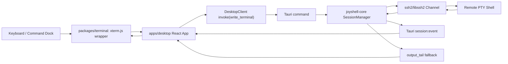

# Terminal SSH Interaction

## Component Scope

This component covers the first usable SSH terminal path:

- React desktop UI receives keyboard input.
- `xterm.js` renders terminal output and emits terminal input.
- Tauri command bridge sends input to Rust.
- `joyshell-core` owns SSH connection lifecycle and channel read/write.
- Rust pushes terminal output to the UI through Tauri events, with a polling fallback from terminal output tail.

Main files:

- `packages/terminal/src/index.tsx`
- `apps/desktop/src/app/JoyshellApp.tsx`
- `apps/desktop/src/features/terminal/use-terminal-runtime.ts`
- `apps/desktop/src/platform/runtime-client.ts`
- `apps/desktop/src/platform/use-session-events.ts`
- `apps/desktop/src-tauri/src/lib.rs`
- `crates/joyshell-core/src/session.rs`

## Mature References

The terminal frontend uses `xterm.js`, a mature terminal rendering library used by many web and desktop terminal products.

Reference:

- https://xtermjs.org/
- https://github.com/xtermjs/xterm.js

The SSH backend uses Rust `ssh2`, which wraps `libssh2`.

Reference:

- https://docs.rs/ssh2/latest/ssh2/
- https://github.com/alexcrichton/ssh2-rs
- https://libssh2.org/
- https://github.com/libssh2/libssh2

For non-blocking SSH channel I/O, `libssh2` official guidance is important: when a libssh2 function returns `LIBSSH2_ERROR_EAGAIN`, the application should check `libssh2_session_block_directions()` and wait for socket read/write readiness before retrying.

Reference:

- https://libssh2.org/libssh2_session_block_directions.html
- https://github.com/libssh2/libssh2/blob/master/example/ssh2_echo.c
- https://github.com/libssh2/libssh2/blob/master/example/ssh2_exec.c

## Problems Found

### 1. Mock Connection Success

Earlier UI behavior showed "connected" without verifying password or real SSH state. This was unacceptable for a desktop SSH client.

Resolution:

- Removed mock success path for real desktop runtime.
- `connect_profile` must call Rust/Tauri backend.
- Rust must perform TCP connect, SSH handshake, password authentication, PTY allocation, and shell startup.
- Wrong password or unreachable host must fail before UI enters connected state.

### 2. Terminal Opened But Could Not Continue Input

Observed behavior:

- The real server banner and prompt appeared.
- Input worked only briefly after connect, or did not visibly affect terminal.
- Diagnostics showed failures such as:
  - `terminal read failed: transport read`
  - `terminal write failed: Failure while draining incoming flow`
  - `terminal channel is closed`

Root cause:

- The SSH loop treated some non-blocking libssh2 states as fatal errors.
- On Windows/libssh2, messages like `transport read` and `Failure while draining incoming flow` can occur during non-blocking flow control.
- Closing the SSH thread on these states caused later UI input to fail with `terminal channel is closed`.

Resolution:

- Added transient SSH I/O classification in `is_transient_ssh_io_error`.
- Treat these as recoverable:
  - `WouldBlock`
  - `TimedOut`
  - `Interrupted`
  - `transport read`
  - `transport write`
  - `draining incoming flow`
  - `resource temporarily unavailable`
- Do not mark the session as failed for these states.

### 2.1 Modern OpenSSH Key Exchange Failed on Windows

Observed behavior:

- `127.0.0.1:2222` was reachable.
- System OpenSSH completed KEX against `OpenSSH_10.2p1`.
- Joyshell/libssh2 failed during handshake:
  - `[Session(-5)] Unable to exchange encryption keys`

Root cause:

- The default Windows `libssh2` build used by `ssh2` had a narrow algorithm set.
- It only exposed `diffie-hellman-*` KEX and RSA host keys.
- The OpenSSH 10.2 server offered modern algorithms such as:
  - `mlkem768x25519-sha256`
  - `sntrup761x25519-sha512`
  - `curve25519-sha256`
  - `ecdh-sha2-*`
  - `ssh-ed25519`
- There was no shared key exchange algorithm, so libssh2 failed before authentication.

Resolution:

- Enabled `ssh2`'s Windows OpenSSL backend:

```toml
ssh2 = { version = "0.9", features = ["openssl-on-win32", "vendored-openssl"] }
```

- Confirmed `ssh2/libssh2` then exposed modern algorithms:
  - `curve25519-sha256`
  - `ecdh-sha2-nistp256`
  - `ssh-ed25519`
  - `chacha20-poly1305@openssh.com`
  - `aes*-gcm`

- Bundled OpenSSL runtime DLLs with NSIS:
  - `libcrypto-3-x64.dll`
  - `libssl-3-x64.dll`

Current packaging files:

- `apps/desktop/src-tauri/resources/windows/openssl/libcrypto-3-x64.dll`
- `apps/desktop/src-tauri/resources/windows/openssl/libssl-3-x64.dll`
- `apps/desktop/src-tauri/windows/openssl-dlls.nsh`
- `apps/desktop/src-tauri/tauri.conf.json`

Long-term note:

- Bundling Conda OpenSSL DLLs is acceptable for MVP testing, but production packaging should move to a reproducible OpenSSL supply chain:
  - vendored OpenSSL with Windows-native Perl available in CI
  - vcpkg-managed OpenSSL
  - or an async-native Rust SSH backend that avoids libssh2/OpenSSL packaging issues.

### 3. Sleep Polling Was Not Mature Enough

The initial loop used a simple sleep-based poll. That worked in the probe, but it did not follow the mature libssh2 pattern closely enough.

Resolution:

- Keep the SSH session in non-blocking mode.
- Clone the TCP socket before handing it to libssh2.
- Register the cloned socket with `mio::Poll`.
- On transient I/O, inspect `ssh2::Session::block_directions()`.
- Wait for socket readiness before retrying.

This follows the same concept as libssh2 examples that call `libssh2_session_block_directions()` after `EAGAIN`.

### 4. Frontend Input Focus Was Ambiguous

Observed behavior:

- The terminal cursor was visible.
- User key presses did not always produce visible terminal output.
- Added input counter showed `in N`, proving React received keyboard input.

Resolution:

- `packages/terminal` still uses `xterm.js` as the primary terminal.
- Added a keyboard fallback on the terminal host container:
  - normal characters
  - Enter
  - Backspace
  - Tab
  - Escape
  - arrow keys
  - Home/End/Delete
- The fallback only runs when the event target is not xterm's internal textarea.
- This avoids double-sending when xterm owns focus, while still recovering when the host container receives key events.

### 5. Tauri Event Delivery Needed a UI Fallback

Observed risk:

- Rust could store output in session tail, but UI might miss a Tauri terminal output event during focus/layout changes.

Resolution:

- Keep event push as the primary path.
- Add an active-session output tail sync every 500 ms.
- The UI keeps a `terminalMirrorRef`.
- If the backend tail starts with the current mirror, append only the new suffix.
- If the tail diverges, clear and rewrite the terminal with the backend tail.

This is a temporary robustness layer for MVP. Long term, terminal output should use a dedicated ordered stream with sequence numbers.

## Current Architecture



## Important Implementation Details

### Input

- Terminal input should be treated as bytes for the remote PTY.
- Do not rewrite xterm input globally.
- Enter is sent as `\r`.
- Backspace is sent as `\x7f`.
- The bottom command dock sends `command + "\r"`.

### Output

- Rust stores recent terminal output in `output_tail`.
- Rust emits `SessionEvent::TerminalOutput`.
- React appends output to xterm and mirrors it in `terminalMirrorRef`.
- React periodically syncs from `terminal_output_tail` as an MVP fallback.

### Diagnostics

`session_diagnostics` reports:

- session id
- connection state
- whether SSH runtime exists
- output tail chunk count
- last transient I/O status

This allowed us to distinguish:

- frontend key events not firing
- backend channel closed
- libssh2 transient flow-control states
- event/output refresh issues

## Verification

Commands used:

```powershell
C:\Users\EDY\.cargo\bin\cargo.exe test --workspace
pnpm -r typecheck
```

Real SSH probe（使用本地测试环境变量，不要把真实凭据提交到仓库）：

```powershell
$env:JOYSHELL_SSH_HOST='ssh.example.internal'
$env:JOYSHELL_SSH_USER='test-user'
$env:JOYSHELL_SSH_PASSWORD='<password>'
$env:JOYSHELL_SSH_PORT='22'
C:\Users\EDY\.cargo\bin\cargo.exe run -p joyshell-core --example ssh_probe
```

Expected probe behavior:

- connect to remote host
- open interactive shell
- run `printf 'joyshell-probe:'; uname -a`
- wait 12 seconds
- run `printf 'joyshell-second:'; pwd`
- receive `/root`

Desktop package:

```powershell
pnpm --filter @joyshell/desktop tauri build --bundles nsis
```

Generated installer:

```text
target/release/bundle/nsis/Joyshell_0.1.43_x64-setup.exe
```

## Current Build Marker

The tested build marker is:

```text
0.1.43 conservative-ui-decoupling-20260724
```

The marker is displayed in the left status card so testers can confirm they are running the intended package.

## Follow-up Work

1. Replace MVP tail polling fallback with a sequence-numbered terminal output stream.
2. Add explicit write result diagnostics:
   - queued
   - written bytes
   - transient I/O reason
   - block direction
3. Add terminal resize propagation:
   - xterm fit result
   - backend PTY window size update
4. Add SSH host key persistence and strict verification path.
5. Add reconnection semantics:
   - remote closed
   - network lost
   - reconnect requested by user
6. Evaluate whether long-term backend should remain `ssh2/libssh2` or move to an async-native SSH implementation after MVP:
   - `russh`
   - `thrussh`
   - maintained fork or custom transport wrapper

## Lessons

- For SSH terminal basics, do not implement behavior from intuition. Follow mature implementations and official protocol library examples.
- Non-blocking SSH errors often indicate "try later", not "disconnect".
- Terminal UI bugs must be diagnosed separately from SSH backend bugs.
- A visible build marker is essential during packaged desktop testing.
- Diagnostics should expose state transitions and transient I/O, not only final failure messages.
